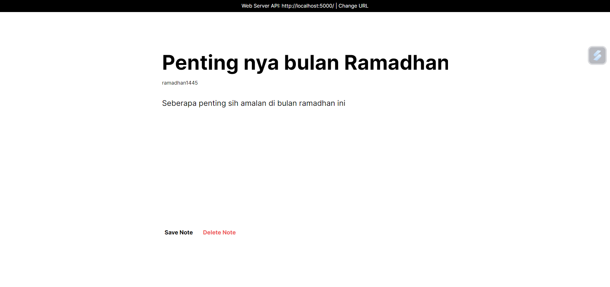
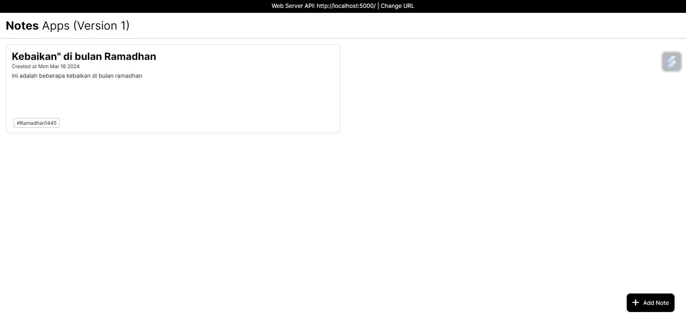

BACK-END DEVELOPER

NOTES APPS

cara menjalankan nya adalah
1. pastikan sudah install node js
2. pastikan sudah install NPM(Node Package Manager)
3. buka program yang sudah di clone
4. lalu jalankan npm run start-dev
5. akan muncul link port 5000 untuk di test di browser yang disable security
6. gunakan beberapa perintah ini untuk membuka chrome disable security
7. # has been blocked by CORS policy: ( ini di blok sama browser chrome )
	1. [path instalasi chrome di windows]\chrome.exe --user-data-dir="C:/Chrome dev session" --disable-web-security  (bersifat sementara)
	2. chrome.exe --user-data-dir="C:/Chrome dev session" --disable-web-security (bersifat sementara tapi normal
	3. & "C:\Program Files (x86)\Google\Chrome\Application\chrome.exe" --user-data-dir="C:/Chrome dev session" --disable-web-security
ini baru lagi

path location (pake cd dulu) = C:\Program Files (x86)\Google\Chrome\Application

LINK YG AKAN DI TEST = http://notesapp-v1.dicodingacademy.com

8. buka link dicoding tsb maka akan muncul seperti ini

# Tampilan awal Apps Notes

# Add Note

# View All Notes

# View Note ById

# Edit Note ById

# View done Delete Note ById
